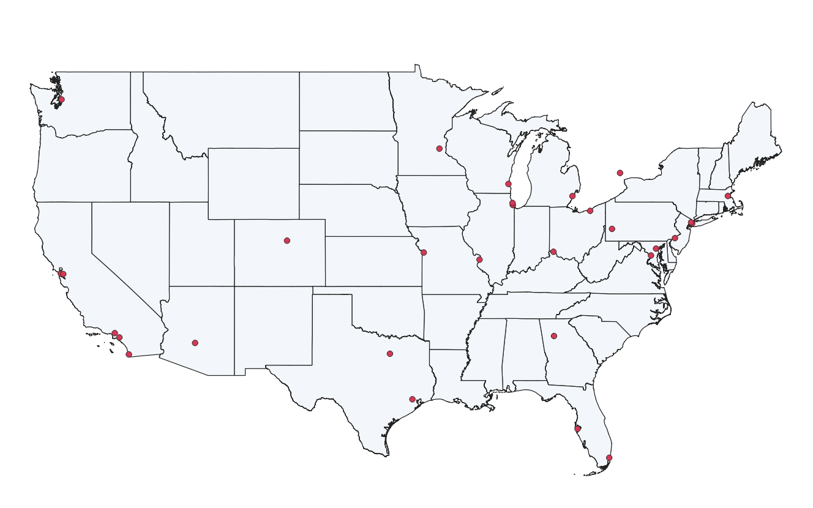
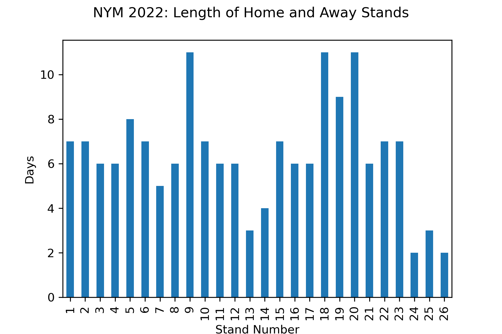
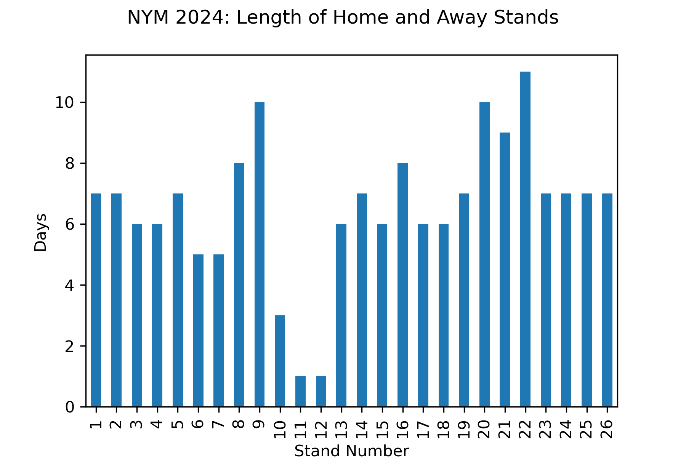
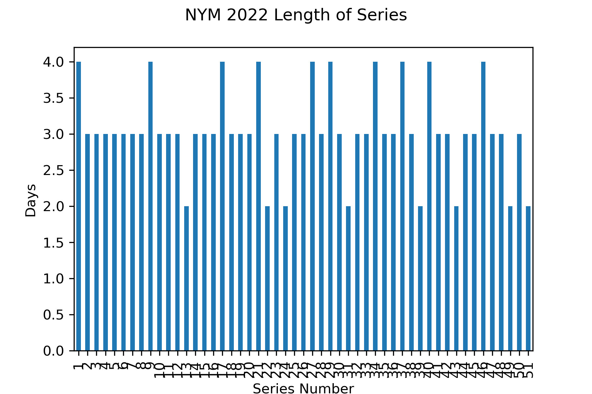
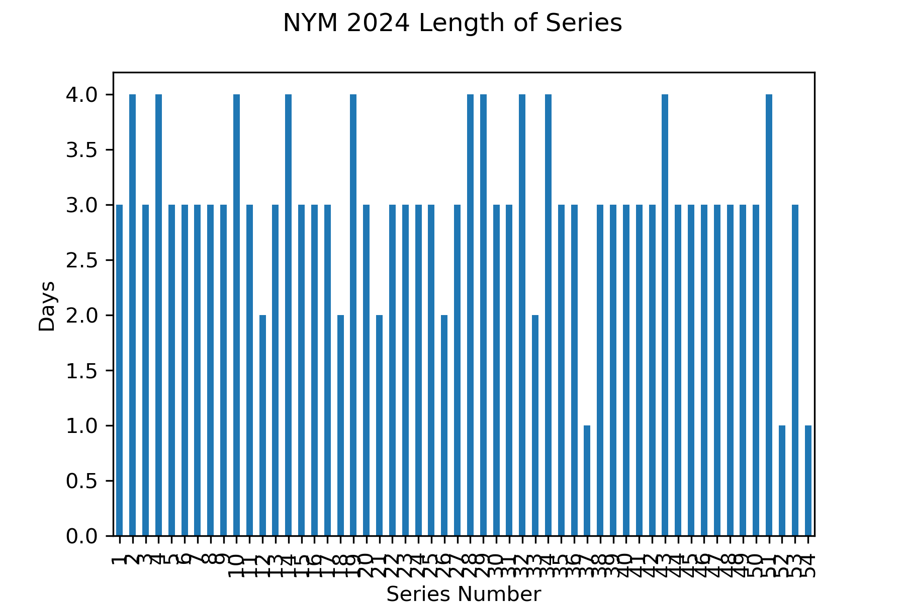

# MLB Schedule Change: Effects on Players, Fans, and the Environment

## Introduction and Motivation

This project was motivated by a [rule change](https://www.mlb.com/news/mlb-rules-changes-refresher-2023-season) made by Major League Baseball (MLB). As of the 2023 season, all thirty MLB teams must play one another at least once during the regular season. This rule change means that teams play fewer games within their division (five teams, grouped regionally, within either the National League [NL] or American League [AL]). They play far more games against teams in the other league (46 instead of 20). The change was a response to a new wild card format and also means that every team faces the big stars in the MLB. 

The rule change has been a pet peeve of mine. For two years, I railed against it, complaining that it destroyed division rivalries. To add moral weight to my argument, I insisted that it must have increased travel, and therefore carbon emissions, enormously. If my beloved Mets no longer played so many games against the Philadelphia Phillies—but they did have to fly out to Seattle to play the Mariners—then surely the team plane must be spewing out far more noxious CO2 each year. Right? Right!?! 

This project seeks to answer the question: **how has the schedule change impacted MLB teams in terms of the number of series they play, who they play against, and how much they travel?** 

Above is an image, generated in QGIS, of all 30 MLB team stadiums graphed on a map of the United States. It gives you a sense of how some stadiums are clustered, and others, like the Colorado Rockies, are far from many other parks.

## Inputs

All of the data is available publicly on the web. All season data comes from [Baseball Reference](https://www.baseball-reference.com/), which is the preeminent website for finding information on baseball teams and players. CSV files with team data for given year are found in the "season_data" folder.

In order to visualize the baseball teams’ locations, I also used a shapefile with information about the 30 MLB stadiums from an [ArcGIS Hub](https://hub.arcgis.com/datasets/f60004d3037e42ad93cb03b9590cafec/explore). The file is located in the "inputs" folder along with a CSV file I made with all the team abbreviations and their divisions. I used QGIS to map the shapefile onto a cartographic boundary map from the [U.S. Census](https://www.census.gov/geographies/mapping-files/time-series/geo/cartographic-boundary.html). 

To find season data for a given team, you can go to the homepage of Baseball Reference, select your team of interest from the “Team” option on the menu, then choose “Schedule & Results.” Choose at the top-right which season you want to examine. Scroll down to “Team Game-by-Game Schedule.” Select “Share & Export” and then “Get Table as CSV.” You can copy CSV data from the website and paste it into a file (unfortunately, there is no way to simply download a CSV file). Save the CSV file to the "season_data" folder for the code to run correctly.

## Python Scripts
1. teams_data.py

This script takes information from the stadiums shapefile and strips it of all data besides the stadium locations and team abbreviations. It is used later to merge onto the schedule information and compute distance calculations. **You only need to run the teams_data script once, not for every team/year analysis.**

2. setup.json 

This is a JSON file, not a script. It should be altered for every team/year analysis you want to perform. The setup file has three keys for team, year, and division. A user can manually change the information to their preferred team and year. It allows the following scripts to be generalized for any MLB team in any year. 

3. season_data.py 

This script cleans the schedule information downloaded from Baseball Reference. It corrects column names and also identifies the location of each game; this will be important for completing distance calculations. 

4. seg_calculations.py 

This script counts home and away segments, known as “stands.” A home stand is when a team is at home; it can include games against more than one team. An away stand is the time spent away from a team’s home field, AKA a road trip. It can also include games against multiple teams. The script graphs stands by length. Each time you run it, it will generate a graph for one team in one season. 

5. series_calculations.py 

The series script counts series – a set of games played against one opponent team. It counts the number of series in a given season, and it tells you the longest, shortest, most common, and average series length. Like the seg script, this script graphs stands by length. 

6. main.py  

This script merges the location data onto the schedule DataFrame. It adds information about stands and seasons, and it counts the number of in-division and out-of-division games. The script also calculates the distance traveled by a team in a given season and how many total days a team traveled. With that information, the script uses some basic figures about carbon emission to calculate total metric tons of carbon emitted for a given season. 

## Outputs

The scripts generate a set of CSV, pickle, and PNG files which are labeled by team and year. They all save to the "outputs" folder. The "outputs" folder currently holds only information from the teams script as well as data about the New York Mets (NYM) in 2022 and 2024. If you run the scripts for different teams, their graphs and CSV files will populate to the "outputs" folder. Information about miles traveled and carbon emitted is printed when you run the scripts.

## Findings

The findings from this project are fairly inconclusive. Some teams traveled more; some traveled less. In general, one thing that *did not* change was how long the teams were on the road versus at home, and how long each series was.
Let's start with the Mets.

### Stands and Series

If you look at graphs of the home and away stands, you will see that the two seasons look fairly similar, suggesting that the MLB  schedulers did a good job at maintaining the status quo—and ensuring that teams did not spend too long away from their home fans. Note, you can ignore the weird set of one-game stands in the middle of the 2024 season. That was a funky thing where the Mets played the Phillies for a two-game series, one game in NY and one in Philadelphia.

The same holds true if you look at the series played. 

### Travel

Now, let's look at travel. In 2022, the Mets traveled 44,320 miles. They had 39 travel days, with 28 by air and 11 by land. In 2024, they traveled 1,326 more miles, for a grand total of 45,646 miles and 42 travel days (33 air/9 land). In this case, the schedule change seems to have led to modest increase in both days traveled and miles covered.  

I was curious whether this result would hold true for other teams. I looked at nine teams in total, including at least one team in each division. The results are quite muddy. 

Some teams traveled a bit more, including the Chicago Cubs (+1,453) and the Cleveland Guardians (+300). Both these are Central Division teams. 

Some teams traveled a decent amount more. In the American League East, the Boston Red Sox traveled an additional 5,377 miles (41,453 to 46,830) and the Toronto Blue Jays traveled 4,312 more miles (39,417 to 43,729). In the National League West, the Arizona Diamondbacks traveled an additional 5,635 miles (46,607 to 52,242), and the Los Angeles Dodgers *(cue envious booing)* traveled 8,364 more miles (47,230 to 55,594). My initial thought that teams that were far from any other team would travel more is complicated by high travel increases for the Red Sox. 

Also interesting, some teams traveled less. Even as Boston and Toronto covered more miles, the New York Yankees traveled less: 2,462 fewer miles (44,183 to 41,721). So did the Texas Rangers who went from 50,103 to 46,596 and traveled 3,507 fewer miles. 

### Caveat about Carbon Emissions

CO2 emissions depend a lot on what plane is being used and how long the flight is. I only calculated carbon based on the total miles, but it would be more accurate to calculate for every flight in a way that would penalize teams taking multiple short flights (which are worse than long, direct flights). I also didn't have information about plane models, so I used an estimation based on roughly 50% using a 737 and 50% using a 757. The carbon numbers are rough approximations at best. What is more accurate are the total miles traveled.

## Conclusion

So what did I learn? Overall, it seems true that teams in the West travel more than NL-and AL-East teams. East teams also seem to travel more than the Central division (perhaps because the ten teams in the Central Division are geographically quite close). But you have to look at each team individually to know how dramatic the change was year to year. And, since I’m only looking at a before and after case, it could be true that there were always big travel fluctuations, and the schedule change isn’t the real explanatory factor.

In 2024, the Mets did travel over 1,000 miles more with three additional days and less land travel compared to the 2022 season. If I only look at my team, I'm somewhat vindicated. But take that with a big grain of Syracuse salt, especially because each team is different, and I don't have an answer for the league as a whole.

